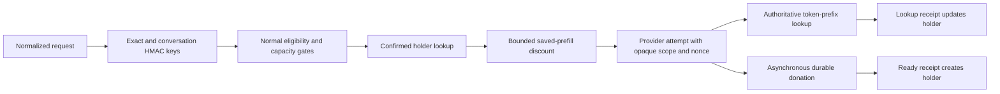

# Provider-confirmed cache-aware routing

Status: implemented behind rollout controls

## Objective

Darkbloom routes exact repeats and growing text conversations toward providers that have
confirmed usable prefix-cache state. Client identifiers and coordinator-derived keys are
routing hints, not proof of KV residency. The provider's token-chain lookup remains the
authority for reuse.

This design replaces the legacy single-provider affinity tracker, first-content recording,
fixed 1,500 ms discount, and 3,000 ms near-tie override. The implementation is centered in
`coordinator/registry/cache_route_keys.go`, `coordinator/registry/cache_receipts.go`,
`coordinator/registry/cache_routing_hints.go`, `coordinator/registry/scheduler.go`, and
`coordinator/api/dispatch.go`.

## Flow



## Separate identities

| Identity | Visible to | Purpose |
|---|---|---|
| Exact route key | Coordinator memory | Match identical normalized provider bodies |
| Conversation route key | Coordinator memory | Match likely growing text prefixes |
| Provider cache scope | Coordinator and selected provider | Partition provider block hashes |
| Receipt nonce | Coordinator and selected provider | Bind feedback to one attempt |
| Engine receipt ID | Selected provider and its engine | Correlate one donation submission without reusing deterministic sampler identity |
| Token-chain key | Provider only | Validate the actual block-aligned token prefix |

Route keys never enter provider messages, logs, route rows, metrics tags, or admin exports.
The provider scope is not the holder-map key. See `coordinator/registry/cache_route_keys.go`,
`coordinator/registry/cache_receipts.go`, and
`provider-swift/Sources/ProviderCore/ProviderLoop+InboundDecode.swift`.

## Key derivation

The coordinator loads a random 256-bit cache master from
`EIGENINFERENCE_CACHE_MASTER_KEY` and derives independent route and scope subkeys. Active
or observation mode fails closed if this secret is missing or malformed. Off mode does not
require it.

The exact key is a domain-separated HMAC over authenticated account, concrete model,
endpoint, and the final normalized provider-bound body. It is calculated after tool-schema
normalization, alias resolution, output-bound injection, and Responses-to-chat lowering.
Retries reuse the same canonical bytes.

Conversation identity uses the first valid source:

1. an authenticated OpenRouter integration key, when a trusted credential seam exists;
2. body `session_id`;
3. `X-Session-Id`;
4. body `prompt_cache_key`; or
5. a derived text anchor.

The derived anchor includes the concrete model and endpoint, ordered normalized tools,
template-affecting fields, the first 1,024 UTF-8 bytes of leading system/developer text,
the first non-system text message, and optional `user` namespace. Media never receives a
derived conversation key. Plain completions receive exact and explicit keys only.

The provider cache scope is an independent HMAC over account, concrete model, expected
weight hash, and explicit identifier, derived anchor, or exact-body fallback. If an
immutable expected weight hash is unavailable, remote provider caching is disabled for the
request. The provider no longer derives remote scope from caller-controlled
`prompt_cache_key` or `user`.

## Protocol

Providers advertise `prefix_cache_protocol: 1` at registration. Capability, rather than a
parsed version string alone, controls whether the coordinator sends cache metadata or
trusts receipts.

Each supported inference envelope may carry:

```json
{
  "cache_receipt_nonce": "base64url random 128-bit value",
  "cache_scope": "opaque scope-v2 value"
}
```

Both fields are coordinator-authored outer-envelope metadata. The encrypted
OpenAI-compatible body remains unchanged.

After adoption resolves, the provider sends one lookup receipt:

```json
{
  "type": "prefix_cache_lookup",
  "request_id": "request-id",
  "cache_receipt_nonce": "nonce",
  "outcome": "hit",
  "tier": "ssd",
  "cached_tokens": 4096,
  "prefill_tokens_saved": 2560,
  "stage_ms": 184
}
```

Outcomes are `hit`, `miss_absent`, `miss_corrupt`, `skipped_capacity`, `skipped_cost`,
and `skipped_policy`. An actual hit refreshes or establishes a holder. Absence and
corruption remove that provider. Capacity refusal suppresses it briefly. Cost or policy
skips do not claim the cache disappeared.

After asynchronous donation settles, the provider may send:

```json
{
  "type": "prefix_cache_ready",
  "request_id": "request-id",
  "cache_receipt_nonce": "nonce",
  "ready_tokens": 8192,
  "required_recompute_tokens": 1536,
  "expected_prefill_tokens_saved": 6656,
  "tier": "ssd"
}
```

SSD ready means encryption, atomic rename, index insertion, global budget enforcement, and
contiguous readability all completed. Queue drops, rate limits, low disk, ENOSPC, write
failure, corruption, shutdown, and immediate eviction do not produce ready. A partial
leading run can report readiness only when it independently clears the benefit floor.
Receipt emission never delays chunks or `inference_complete`.

New protocol and usage fields are optional. Old providers remain eligible but serve
uncached. New providers receiving an old-coordinator request serve it uncached rather than
falling back to a shared remote scope. Go and Swift wire shapes live in
`coordinator/protocol/messages.go` and
`provider-swift/Sources/ProviderCore/Protocol/Messages.swift`.

## Holder lifecycle

The coordinator stores up to four connected holders per exact or conversation key. Each
holder records provider connection, model, ready and recompute tokens, expected saved
tokens, tier, confirmation time, expiry, suppression, and last outcome.

An attempt nonce is registered before its inference frame is written and binds request,
provider connection, model, exact key, and conversation key. Lookup is single-event. Ready
tokens must increase monotonically. Attempt records survive terminal inference for two
minutes because SSD writes complete asynchronously. Attempts also receive a coordinator-
local monotonic sequence: a delayed negative receipt from an older attempt cannot remove
or suppress holder evidence established by a newer attempt, while a newer miss can still
invalidate older evidence.

Attempt and holder caps use indexed oldest-first heaps, so steady-state insertion at the
50,000-attempt and 10,000-holder global bounds remains logarithmic. Expiry sweeps are
time-gated, while every lookup, ready receipt, and routing hint still validates its own
expiry directly. See `coordinator/registry/cache_routing.go` and
`coordinator/registry/cache_receipts.go`.

Holders expire after ten minutes, are refreshed only by a confirmed hit or ready receipt,
and are removed on provider disconnect. Coordinator restart intentionally clears them.
Unknown, expired, replayed, cross-provider, or post-disconnect receipts are ignored. The
tracker owns its mutex and does not perform hashing or network I/O under registry/provider
locks.

## Routing

Cache state is considered only after every existing gate passes, including ownership,
serial allowlists, trust, privacy, attestation freshness, runtime verification, provider
breakers, model and template support, tool and vision traits, version floors, thermal and
cooldown state, loaded-slot state, memory, concurrency, queues, pooled KV, full token
budget, and TTFT admission.

Reservations continue to use the full prompt and requested output. A stale receipt or
staging refusal must safely fall back to cold prefill without overcommitment.

For an eligible holder:

```text
predicted_matched = min(holder.ready_tokens, estimated_prompt_tokens)
saved_tokens = max(0, predicted_matched - holder.required_recompute_tokens)
saved_ms = 1000 * saved_tokens / cache_miss_prefill_tps
net_ms = max(0, saved_ms - predicted_stage_ms)

confidence = 1.0 exact, 0.6 explicit conversation, 0.4 derived conversation
discount = confidence * min(net_ms, 1000ms, baseline_cost * 0.35)
adjusted_cost = baseline_cost - discount
```

Prefill rate must come from cache-miss measurements or a safe benchmark fallback, never an
EWMA contaminated by cache hits. Exact and conversation discounts do not stack. There is
no hard affinity override. A busy holder whose adjusted cost is still worse loses to an
idle provider without a cache.

Modes are `off`, `observe`, `exact`, and `conversation`. Observe calculates hypothetical
selection without changing the winner. Dedicated models require their separate enable
control. Cache evidence never changes warm-pool targets. The coordinator controls are:

| Environment variable | Default | Purpose |
|---|---:|---|
| `EIGENINFERENCE_CACHE_ROUTING_MODE` | `off` | Rollout mode |
| `EIGENINFERENCE_CACHE_ROUTING_TTL` | `10m` | Confirmed-holder lifetime |
| `EIGENINFERENCE_CACHE_ROUTING_MAX_HOLDERS` | `4` | Holders retained per route key |
| `EIGENINFERENCE_CACHE_ROUTING_MAX_DISCOUNT_MS` | `1000` | Absolute cost-discount cap |
| `EIGENINFERENCE_CACHE_ROUTING_MAX_COST_FRACTION` | `0.35` | Relative cost-discount cap |
| `EIGENINFERENCE_CACHE_ROUTING_DEDICATED` | `false` | Permit discounts in dedicated pools |
| `EIGENINFERENCE_CACHE_MASTER_KEY` | none | 32-byte base64 or hex master secret |

`observe`, `exact`, and `conversation` fail startup when the master secret is absent or
malformed. `off` starts without a secret and disables remote cache participation.

## Provider cache lifecycle

The encrypted SSD tier retains current token-chain, weight, layout, block-size, media, and
lossless-snapshot checks in
`provider-swift/Sources/ProviderCore/KVCacheSSD/SSDPrefixCache.swift`.

Startup and periodic maintenance account for every owned model directory under the `kv2`
root, including unloaded models. Sliding TTL and the box-wide byte budget therefore do not
depend on a model slot being loaded. Maintenance does not load weights or allocate KV
tensors and does not touch unrecognized directories. Crash-temp ownership requires the
exact `<32-lowerhex>.dbk2.darkbloom-tmp.<UUID>` filename under a valid 12-hex model and
matching 2-hex fanout directory; near-matches are preserved. See
`provider-swift/Sources/ProviderCore/KVCacheSSD/SSDBlockStore.swift` and
`provider-swift/Sources/ProviderCore/KVCacheSSD/SSDWholeRootMaintainer.swift`. The UUID must
use the writer's canonical uppercase spelling. Young temporary files are treated as active:
their bytes count toward the global budget, but neither TTL nor budget maintenance deletes
them. Only exact owned temporary files at least one hour old are crash-orphan candidates.
Deletion-sensitive traversal also rejects a maintenance root reached through a symlinked
path component, in addition to rejecting symlinked model and fanout descendants.

Natural completion remains the first donation path. Early prompt-only donation occurs
after full prefill and the first sampled token, behind `DARKBLOOM_EARLY_PROMPT_DONATION`
and off by default. It keeps multimodal and lossy quantized requests excluded and uses
immutable contiguous snapshots. Paged early donation is explicitly disabled until the
paged backend exposes a safe page-lease or copied-snapshot contract; paged terminal
donation remains enabled and materialized. Terminal donation can later extend the prefix.
At most two early donations are pending by default. Cancellation and error retirement keep
backend byte accounting charged and defer storage release behind any queued early donation.
Each cache-enabled submission receives a unique `prefixCacheReceiptID`, separate from the
deterministic sampler request ID. See
`libs/mlx-swift-lm/Libraries/MLXLMCommon/ContinuousBatchingV2/EngineLoopV2.swift` and
`provider-swift/Sources/ProviderCore/Inference/EngineV2Bridge.swift`. Completion clears the
request's exact pending-job identity; later cancellation or preemption therefore releases
immediately instead of waiting behind unrelated donation-queue work. A request whose own
donation is still materializing remains charged until that job completes.

## Telemetry and billing

Low-cardinality telemetry records source kind, holder availability, hypothetical and
actual selection, baseline and adjusted cost, discount, outcome, tier, cached tokens,
prefill tokens saved, and stage time. It never records keys or client identifiers. Cold
prefill, memory hit, SSD staging, and post-adoption prefill remain separate measurements.

Cached tokens remain part of prompt-token billing in this release. Provider terminal usage
reports cache details for calibration. OpenAI chat and Responses output now fills the
existing standard `cached_tokens` usage detail when a validated hit occurs; totals and
prices do not change. Anthropic billing and usage totals remain unchanged.

## Rollout and rollback

1. Release providers with protocol 1, account-bound scope, receipts, and whole-root
   maintenance.
2. Raise the provider floor past legacy caller-derived remote scopes.
3. Disable legacy first-content affinity and route-key persistence. The PostgreSQL startup
   migration scrubs historical `cache_affinity_key` values, and a compatibility trigger
   clears writes from an older coordinator during blue-green overlap or rollback.
4. Enable receipt and holder observation.
5. Enable exact routing for a narrow canary.
6. Enable explicit conversation routing, then derived anchors.
7. Canary dedicated models independently.
8. Enable early prompt donation independently after contiguous and paged safety tests.

Rollback sets routing to `observe` or `off`, then independently disables receipts or early
donation. Rollback never restores caller-controlled or unscoped remote namespaces.

Active rollout requires exact selected-holder precision of at least 95 percent, explicit
conversation precision of at least 85 percent, and derived-anchor precision of at least 70
percent. Non-hit p95 time to first content may not regress more than two percent. No phase
may bypass an eligibility/capacity gate, increase provider OOM/corruption, persist route
keys, or prevent an idle non-holder from beating a materially busier holder.
